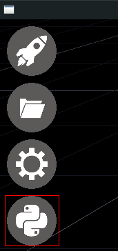

# PySSA documentation

This is a documentation for PySSA - ESSA Python scripting.

PySSA uses Python 3.5+ as interpreter.

## Python to native objects

Every Python object created in this API is a weak reference to the corresponding native (i.e. C++) object. When the native object is removed (e.g through the GUI), the Python reference becomes invalid and every access to it results in a `ReferenceError` exception.

## Ways of calling Python

In ESSA, there are currently 2 ways to run Python code:

### Through PySSA REPL

### Using startup script

ESSA runs a `test.py` script on startup (just after Python environment is initialized).

### Types

In these docs:

* `Vec3` is a tuple of 3 `float`s.
* `ColorRGB` is a tuple of 3 `int`s in range 0 - 255

## `pyssa` module

The `pyssa` is a global module which is automatically included for every script run in PySSA.

### Objects

* `pyssa.world` - Access to the currently opened [World](./World.md).
* `pyssa.sv` - Access to the [SimulationView](./SimulationView.md), can be used to control camera, focused object etc.
